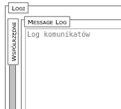

jQuery – GroupBox
=================

Simple [jQuery](https://jquery.com/) plugin to make groupbox.


## Installation

Download `groupbox.js` and `groupbax.css` files and add to HTML:

```javascript
	<link rel="stylesheet" href="groupbox.css"/>
	<script src="groupbox.js"></script>
```


## Usage

To handle GroupBox you can use.

```html
<div class="groupbox" data-groupbox-title="My group">
 <p>Content</p>
 <p>More content</p>
</div>

<script>
$(function () {
  $('.groupbox').groupbox();
});
</script>
```

There are a few operation on groupbox element.
* `unfold` (or `open`) – unfold content
* `fold` – fold content
* `toggle` –  toggle content fold
* `init` – initialize groupbox (default action)


## Options

There are no option in JS yet.

You can add some code to HTML.

* `data-groupbox-title` – title of groupbox
* `data-groupbox-mode` – direction `vertical` (default) or `horizontal`
* `data-groupbox-state` – group box state, `opened` or `folded`

You can use class `horizontal` or `folded` instead of last two `data-` values.


## Example

```html
<div class="groupbox horizontal" data-groupbox-title="Logi">
 <div class="groupbox" data-groupbox-title="Współrzędne">
  ...
 </div
 <div class="groupbox" data-groupbox-title="Message Log">
  ...
 </div
</div
```





